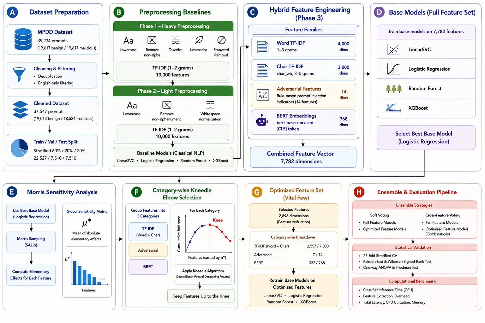

# NextFirewall: Lightweight Prompt Guard 

### A Hybrid Machine Learning Framework for Replacing Heavyweight LLM Guard Models
---

## Results at a glance

| Metric | Result |
|---|---|
| **Best model** | Cross-Feature Ensemble ((Logistic Regression + XGBoost) × Full Features) + ((Linear SVC + XGBoost) × Optimized Features) |
| **Held-out test accuracy** | **97.30%** |
| **F1 / AUC-ROC / MCC** | **0.972 / 0.994 / 0.947** |
| **Feature reduction** | **7,782 → 2,896 features (−62.8%)** using Morris Sensitivity Analysis + Kneedle |
| **Training speedup** | Up to **15.3×** faster after feature optimization |
| **Saved model size** | **≈655 KB** |
| **Classifier inference** | **≈0.052 ms/sample (CPU)**, **≈0.062 ms/sample (GPU)** |
| **Feature extraction** | **≈134 ms/sample (CPU)**, **≈13 ms/sample (GPU)** |
| **Dataset** | **37,547 cleaned prompt samples** |
| **Statistical validation** | 25-fold CV, paired t-test, Wilcoxon, ANOVA, Friedman (*p* < 0.05) |

---

## 📌 Project Overview

Large Language Model (LLM) applications commonly rely on an additional LLM-based guard model to detect prompt injection attacks before forwarding user prompts to the target model. Although effective, this approach increases computational cost, memory requirements, inference latency, and deployment complexity because every user request requires an additional large-model inference.

This project proposes a lightweight machine learning alternative that replaces heavyweight prompt guard models with a hybrid feature-based detection framework. The proposed system combines TF-IDF features, contextual BERT embeddings, and handcrafted adversarial linguistic features with sensitivity-guided feature optimization and ensemble learning to achieve high detection performance while significantly reducing model complexity.

The complete pipeline includes three preprocessing phases, hybrid feature engineering, Morris Sensitivity Analysis, category-wise Kneedle feature selection, retraining on optimized features, ensemble learning, statistical validation, and computational cost benchmarking.

The final Cross-Feature Ensemble achieved **97.30% held-out test accuracy** while reducing the feature space by **62.8%**, demonstrating that lightweight machine learning can provide an effective alternative to heavyweight LLM guard models.

---

## 🎯 Research Objectives

- Develop a lightweight alternative to LLM-based prompt guard models.
- Reduce feature dimensionality while maintaining detection performance.
- Improve robustness through hybrid feature engineering and ensemble learning.
- Validate effectiveness using statistical testing and computational benchmarking.

===

## ⭐ Key Contributions

This work introduces several technical contributions:

- A complete three-phase lightweight prompt injection detection framework.
- Hybrid feature engineering combining Word TF-IDF, Character TF-IDF, handcrafted adversarial features, and BERT embeddings.
- Morris Sensitivity Analysis for global feature importance estimation.
- Category-wise Kneedle Elbow feature selection that preserves important information while reducing feature dimensionality.
- Retraining of multiple machine learning models using optimized feature subsets.
- Cross-feature ensemble learning that combines predictions from models trained on different feature spaces.
- Statistical validation using paired hypothesis testing.
- Computational cost benchmarking including inference latency, CPU utilization, memory consumption, and feature extraction overhead.


## 🏗️ System Architecture



## 📂 Repository Structure

```text
NextFirewall-Lightweight-Prompt-Guard/
│
├── figures/
│   ├── Prompt-github-methodology.png
│   └── .gitkeep
│
├── notebook/
│   ├── prompt-injection-base-retrained-ensemble-final.ipynb
│   ├── prompt-injection_statistical_test.ipynb
│   ├── computational-cost-base-retrained-cpu.ipynb
│   ├── computational-cost-cpu-run1.ipynb
│   ├── computational-cost-cpu-run2.ipynb
│   ├── computational-cost-gpu-run1.ipynb
│   ├── computational-cost-gpu-run2.ipynb
│   ├── computational-cost-gpu-run3.ipynb
│   └── computational-cost-gpu-run4.ipynb
│
├── .gitignore
├── README.md
└── requirements.txt
```

## 💻 Technologies Used

Programming Language

- Python

Machine Learning

- Scikit-learn
- XGBoost

Deep Learning

- PyTorch
- Hugging Face Transformers

Natural Language Processing

- spaCy
- NLTK

Feature Engineering

- TF-IDF
- BERT
- Adversarial Linguistic Features

Feature Selection

- Morris Sensitivity Analysis
- Kneedle Algorithm

Statistical Analysis

- Paired t-test
- Wilcoxon Signed-Rank Test
- ANOVA
- Friedman Test

Visualization

- Matplotlib
- Seaborn

Utilities

- Joblib
- Pandas
- NumPy

## 📈 Technical Skills Demonstrated

This project demonstrates practical experience in:

- End-to-end machine learning pipeline development
- Natural Language Processing (NLP)
- Feature engineering
- Feature optimization
- Sensitivity analysis
- Ensemble learning
- Statistical model validation
- Computational performance benchmarking
- Research-oriented machine learning
- Model evaluation and comparison
- Python-based ML development


---

## Dataset

- Source: **MPDD** (Malicious Prompt Detection Dataset), Kaggle — 39,234 prompts, perfectly balanced (19,617 benign / 19,617 malicious) on the `isMalicious` label.
- Cleaning: exact + case-insensitive de-duplication, English-only filtering (`langdetect`) → **37,547 prompts** (19,013 benign / 18,534 malicious — still near-balanced).
- Split: stratified 60% train / 20% validation / 20% test → **22,527 / 7,510 / 7,510** samples.

---


## Phase 1 & Phase 2 — Preprocessing Baselines

Two preprocessing strategies were benchmarked before the hybrid pipeline, each feeding a 10,000-feature TF-IDF (1–2 grams) into the same four algorithms (LinearSVC, Logistic Regression, Random Forest, XGBoost):

- **Phase 1 ("heavy")**: lowercase → strip non-alphabetic characters → NLTK tokenize → lemmatize → stopword removal.
- **Phase 2 ("light")**: lowercase → strip non-alphanumeric characters → whitespace normalization. No tokenization, lemmatization, or stopword removal.

These phases established a classical-NLP baseline and a compute-cheaper alternative before introducing the heavier hybrid (BERT-inclusive) feature set in Phase 3.


## Phase 3 — Hybrid Feature Engineering

Combined four feature families using a **scikit-learn `ColumnTransformer`** into a **7,782-dimensional** feature vector.

| Feature | Method | Dims |
|---------|--------|-----:|
| Word TF-IDF | 1–3 grams | 4,000 |
| Char TF-IDF | `char_wb`, 3–5 grams | 3,000 |
| Adversarial | Rule-based prompt injection indicators | 14 |
| BERT | `bert-base-uncased` `[CLS]` embeddings | 768 |
| **Total** |  | **7,782** |


## Base Models (full feature set)

Trained on all 7,782 features:

| Model | Test Accuracy | Test AUC-ROC | Test MCC |
|---|---|---|---|
| **Logistic Regression** | **97.15%** | 0.9930 | 0.9432 |
| XGBoost | 96.74% | 0.9925 | 0.9355 |
| LinearSVC | 96.58% | 0.9913 | 0.9316 |
| Random Forest | 95.86% | 0.9880 | 0.9190 |

**Logistic Regression was the strongest single base model and was used to drive the feature-selection step below.**


## Feature Selection: Morris Sensitivity + Kneedle Elbow

- Performed **Morris Sensitivity Analysis** on the best baseline model (**Logistic Regression**).
- Grouped features into three categories:
  - TF-IDF
  - Adversarial
  - BERT
- Ranked features in each category by **μ\*** (mean absolute elementary effect).
- Applied the **Kneedle algorithm** (`kneed`) to each category's cumulative influence curve.
- Selected features up to the detected **elbow (knee) point**, preserving the most influential features while removing low-impact ones.
- Used **category-wise selection** to ensure balanced representation across all feature groups.


**Result:**

| Category | Kept / Total | Cumulative influence retained |
|---|---|---|
| TF-IDF (word + char) | 2,557 / 7,000 | 79.5% |
| Adversarial | 7 / 14 | 87.1% |
| BERT | 332 / 768 | 73.0% |
| **Total** | **2,896 / 7,782 (−62.8%)** | — |


## Retrained Models (optimized feature set)

Same four algorithms, retrained from scratch on the 2,896-feature "vital few" set:

| Model | Test Accuracy | Δ vs. base | Test AUC-ROC |
|---|---|---|---|
| Logistic Regression | 97.08% | −0.07 pt | 0.9926 |
| XGBoost | 96.99% | +0.25 pt | 0.9929 |
| LinearSVC | 96.83% | +0.25 pt | 0.9921 |
| Random Forest | 96.01% | +0.15 pt | 0.9886 |

Retraining on 63% fewer features preserved accuracy (within ±0.25%) while reducing cross-validation training time by up to 15.3×.

| Model | Base CV time | Retrained CV time | Speedup |
|---|---|---|---|
| LinearSVC | 1,122.0 s | 73.2 s | **15.3×** |
| Logistic Regression | 874.1 s | 268.5 s | **3.3×** |
| XGBoost | 1,362.0 s | 593.2 s | **2.3×** |
| Random Forest | 1,567.7 s | 1,125.6 s | 1.4× |


## Ensemble Strategies

Five ensemble strategies were evaluated using Soft Voting and Cross-Feature Voting across full and optimized feature sets.
| Strategy | Composition | Voting type |
|---|---|---|
| 1 | 4 base models (LinearSVC, LR, RF, XGBoost) — full features | Soft voting |
| 2 | 4 retrained models — optimized features | Soft voting |
| 3 | LR + XGBoost (full) **and** LR + XGBoost (optimized) | Cross-feature |
| 4 | LR (full) **and** LinearSVC + XGBoost (optimized) | Cross-feature |
| 5 | LR + XGBoost (full) **and** LinearSVC + XGBoost (optimized) | Cross-feature |

## Statistical Validation

Model performance was validated using:

- 25-fold Stratified Cross-Validation
- Paired t-test and Wilcoxon Signed-Rank Test
- One-way ANOVA and Friedman Test

All ensemble improvements were statistically significant (**p < 0.05**). Feature pruning primarily improved computational efficiency, while the performance gains were achieved through ensemble learning.

## Final Results — Held-Out Test Set

| Ensemble | Test Accuracy | Test F1 | Test AUC-ROC | Test Precision | Test Recall | Test MCC |
|---|---|---|---|---|---|---|
| Cross-Feature (LR + XGB) | 97.30% | 0.9721 | 0.9938 | 0.9908 | 0.9541 | 0.9465 |
| **Cross-Feature (LR+XGB-Full \| SVC+XGB-Opt)** | **97.30%** | 0.9721 | 0.9937 | 0.9916 | 0.9533 | 0.9466 |
| Cross-Feature (LR-Full + SVC/XGB-Opt) | 97.28% | 0.9720 | 0.9935 | 0.9894 | 0.9552 | 0.9462 |
| Soft-Voting — Full Features | 97.22% | 0.9712 | 0.9938 | 0.9913 | 0.9520 | 0.9450 |
| Soft-Voting — Optimized Features | 97.08% | 0.9698 | 0.9940 | 0.9913 | 0.9493 | 0.9425 |

**Best overall: the Cross-Feature Ensemble (LR+XGB-Full \| SVC+XGB-Opt)** — highest test accuracy, F1, and AUC-ROC of the five.

## Computational Cost Benchmark

Computational benchmarking was performed on both CPU and NVIDIA Tesla P100 GPU.

| Metric | CPU | GPU |
|---|---:|---:|
| Feature Extraction | **≈134 ms/sample** | **≈13 ms/sample** |
| Strategy 5 Classifier Inference | **≈0.052 ms/sample** | **≈0.062 ms/sample** |
| End-to-End Latency | **≈134 ms/sample** | **≈13 ms/sample** |
| Saved Model Size | **≈655 KB** | **≈655 KB** |
| Test Accuracy | **97.30%** | **97.30%** |

> End-to-end latency is dominated by BERT embedding extraction. The lightweight ensemble itself requires only around **0.05–0.06 ms** for prediction.

## Key Findings

- Achieved **97.30% test accuracy** and **0.994 AUC-ROC** using a lightweight hybrid feature framework without LLM-based guard models.
- Reduced the feature space by **62.8%** (7,782 → 2,896 features) using Morris Sensitivity Analysis and Kneedle selection while maintaining performance.
- Cross-feature ensemble learning delivered the best overall performance, outperforming individual base models.
- Feature optimization significantly reduced training time (up to **15×** faster), while BERT feature extraction remained the primary inference bottleneck.

## Deployment Highlights

- Lightweight ensemble model (~655 KB)
- No LLM inference required during prompt classification
- Real-time classifier inference (~0.05 ms/sample)
- 97.30% detection accuracy
- Suitable for deployment as an API, browser extension, chatbot middleware, or edge security service


## Future Work

- Replace BERT with a lightweight sentence encoder (e.g., MiniLM, DistilBERT, or E5-small) to further reduce end-to-end latency.
- Package the best ensemble as a lightweight API for deployment.
- Evaluate on additional prompt injection datasets to assess generalization.
- Expand testing with adversarial/red-team prompts.
- Compare performance against existing prompt guard solutions.

---


## Reproducing This Work

The complete implementation is provided as Jupyter notebooks in the `notebooks/` directory. The repository includes:

- The complete hybrid feature engineering and ensemble learning pipeline
- Morris Sensitivity Analysis and Kneedle-based feature selection
- Statistical validation experiments
- CPU and GPU computational cost benchmarking

The notebooks support both **CPU** and **CUDA-enabled GPU** execution. A GPU is recommended for faster BERT embedding extraction, while the lightweight ensemble classifier itself runs efficiently on either CPU or GPU.

Before running the notebooks, install the project dependencies and download the required spaCy language model.

```bash
pip install -r requirements.txt
python -m spacy download en_core_web_sm
```


## Quick Start

### 1. Clone the repository

```bash
git clone https://github.com/<your-username>/NextFirewall-Lightweight-Prompt-Guard.git
cd NextFirewall-Lightweight-Prompt-Guard
```

### 2. Install dependencies

```bash
pip install -r requirements.txt
python -m spacy download en_core_web_sm
```

### 3. Launch Jupyter Notebook

```bash
jupyter notebook
```

Open and run:

```text
notebooks/prompt-injection-base-retrained-ensemble-final.ipynb
```
